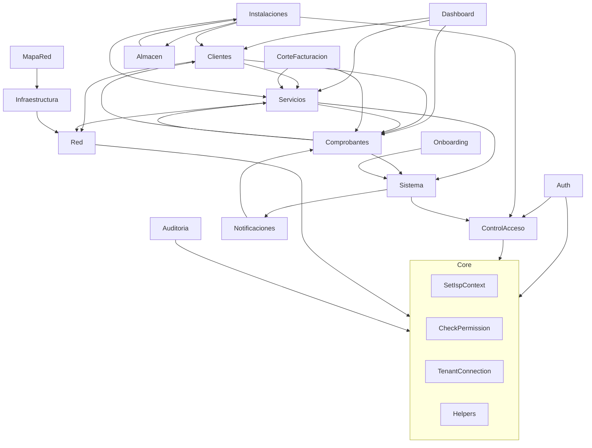

# Análisis exhaustivo del sistema por módulos — Admin ISP

Fecha: 2026-02-11. Documentación módulo por módulo para referencia y base de modificaciones posteriores.

Complementa [ANALISIS_PROYECTO_COMPLETO.md](ANALISIS_PROYECTO_COMPLETO.md) y [ANALISIS_BD_COMPLETO.md](ANALISIS_BD_COMPLETO.md).

---

## Índice

1. [Auth](#1-auth)
2. [Dashboard](#2-dashboard)
3. [ControlAcceso](#3-controlacceso)
4. [Clientes](#4-clientes)
5. [Servicios](#5-servicios)
6. [Comprobantes](#6-comprobantes)
7. [CorteFacturacion](#7-cortefacturacion)
8. [Red](#8-red)
9. [Instalaciones](#9-instalaciones)
10. [Infraestructura](#10-infraestructura)
11. [MapaRed](#11-mapared)
12. [Almacen](#12-almacen)
13. [Notificaciones](#13-notificaciones)
14. [Sistema](#14-sistema)
15. [Auditoria](#15-auditoria)
16. [Onboarding](#16-onboarding)
17. [Resumen de dependencias entre módulos](#17-resumen-de-dependencias-entre-módulos)

---

## 1. Auth

### Identificación

- **Propósito:** Autenticación de usuarios del panel (login/logout por email y contraseña).
- **Ámbito:** Central (usuarios en BD central; sesión web).

### Registro y carga

- Rutas cargadas por **require** en [routes/web.php](routes/web.php) (no por ModuleServiceProvider). Provider registrado en [bootstrap/app.php](bootstrap/app.php) pero no llama a `loadRoutesFrom`.
- No tiene rutas en [routes/api.php](routes/api.php).

### Rutas

| Método | URI | Nombre | Controlador | Middleware |
|--------|-----|--------|-------------|------------|
| GET | /login | login | AuthenticatedSessionController@create | guest |
| POST | /login | — | AuthenticatedSessionController@store | throttle:5,1 |
| POST | /logout | logout | AuthenticatedSessionController@destroy | auth |

### Controladores

- **AuthenticatedSessionController:** create = formulario login (vista auth.login); store = validar LoginRequest, Auth::attempt, redirigir a dashboard o superadmin.dashboard; destroy = logout y redirigir a login. Usa TenantConnectionService tras login para registrar conexión tenant si el usuario tiene isp_id.

### Modelos

- No define modelos propios; usa `App\Modules\ControlAcceso\Models\User` (tabla central `users`).

### Servicios / Repositories / Políticas

- Ninguno en el módulo.

### Form Requests

- **LoginRequest:** validación email (required, email), password (required).

### Eventos y Listeners

- Ninguno.

### Vistas (Blade)

- `resources/views/auth/login.blade.php`

### Permisos

- No aplica (rutas públicas o auth genérico).

### Dependencias

- Core: TenantConnectionService, AuditLog (opcional). ControlAcceso: User. Http: Controller base.

### Para modificaciones posteriores

- Cambiar flujo de login: editar `AuthenticatedSessionController`, `LoginRequest`, vista `auth/login`.
- Añadir 2FA o recordar dispositivo: extender store/destroy y posiblemente migración en central para tabla tokens.

---

## 2. Dashboard

### Identificación

- **Propósito:** Página principal del panel tras el login; resumen de indicadores (clientes, servicios, cobranza).
- **Ámbito:** Tenant (datos agregados por ISP).

### Registro y carga

- Rutas definidas en [routes/web.php](routes/web.php) dentro del grupo `auth` (/, /dashboard). ModuleServiceProvider registrado pero no carga rutas.
- No tiene rutas en api.php.

### Rutas

| Método | URI | Nombre | Controlador |
|--------|-----|--------|-------------|
| GET | / | dashboard | DashboardController@index |
| GET | /dashboard | dashboard | DashboardController@index |

### Controladores

- **DashboardController:** index = obtiene datos vía DashboardService (o DashboardRepository) y devuelve vista dashboard.

### Modelos

- No define modelos; usa Clientes, Servicios, Comprobantes (recibos/pagos) para agregados.

### Servicios / Repositories

- **DashboardService:** lógica de agregados para el dashboard.
- **DashboardRepository:** consultas para indicadores (contrato en Core: DashboardRepositoryInterface).

### Políticas / Form Requests / Eventos

- Ninguno específico.

### Vistas (Blade)

- `resources/views/dashboard.blade.php`

### Permisos

- Acceso por middleware auth; sin permiso granular (todo usuario autenticado ve dashboard).

### Dependencias

- Clientes, Servicios, Comprobantes (lectura de datos). Core: BaseRepository si aplica.

### Para modificaciones posteriores

- Añadir/K quitar widgets: DashboardController, DashboardService o DashboardRepository, vista dashboard.blade.php.
- Cambiar métricas: revisar DashboardRepository y migraciones tenant si se cachean en BD.

---

## 3. ControlAcceso

### Identificación

- **Propósito:** Gestión de usuarios, roles, permisos, perfil y configuración general del panel (RBAC).
- **Ámbito:** Central (users, roles, permissions en BD central); perfil y settings por usuario.

### Registro y carga

- Rutas cargadas por **ModuleServiceProvider** (loadRoutesFrom) en [bootstrap/app.php](bootstrap/app.php).
- No tiene rutas en api.php.

### Rutas

- **Perfil:** GET/PUT profile, profile/edit, profile/password, profile/password.update (ProfileController).
- **Settings:** GET settings (SettingsController).
- **Users:** resource users (UserController), throttle 60,1.
- **Roles:** resource roles (RoleController), throttle 60,1.
- **Permissions:** resource permissions solo index, create, store, show (PermissionController); rutas adicionales permissions/resources/show, edit, update, destroy (y variantes resource/show, edit, update, destroy).

### Controladores

- **UserController:** CRUD usuarios (index, create, store, show, edit, update, destroy). Vistas users.*.
- **RoleController:** CRUD roles (index, create, store, show, edit, update, destroy). Vistas roles.*.
- **PermissionController:** index, create, store, show; showResource, editResource, updateResource, destroyResource para gestión de recursos por permiso. Vistas permissions.*.
- **ProfileController:** index, edit, update (perfil); password, updatePassword (cambio contraseña). Vistas profile.*.
- **SettingsController:** index (configuración). Vista settings.index.

### Modelos

- **User:** tabla central `users`; relaciones role, isp; métodos hasRole, hasPermission, hasAnyRole, hasAnyPermission, isSuperAdmin, isRootUser.
- **Role:** tabla central `roles`; relación permissions (belongsToMany).
- **Permission:** tabla central `permissions`; relación roles; estructura por recurso (nombre, recurso, acciones).

### Servicios

- **UserService:** lógica alta de usuarios (crear, actualizar, asignar rol/ISP).
- **RoleService:** gestión de roles y asignación de permisos.
- **PermissionService:** gestión de permisos y recursos.

### Repositories

- **UserRepository,** **PermissionRepository,** **RoleRepository:** consultas y listados.

### Políticas

- **UserPolicy,** **RolePolicy,** **PermissionPolicy:** view, create, update, delete; criterios por rol/permiso del usuario actual.

### Form Requests

- StoreUserRequest, UpdateUserRequest, UpdatePasswordRequest, UpdateProfileRequest; StoreRoleRequest, UpdateRoleRequest; StorePermissionRequest, UpdatePermissionResourceRequest, DestroyPermissionResourceRequest.

### Eventos y Listeners

- **UserActualizado,** **RoleActualizado,** **PermissionActualizado** → listener **InvalidarCacheControlAcceso** (invalidar caché de permisos/roles por usuario).

### Vistas (Blade)

- `resources/views/users/`, `resources/views/roles/`, `resources/views/permissions/`, `resources/views/profile/`, `resources/views/settings/`, `control-acceso/tabs.blade.php`.

### Permisos

- Rutas protegidas por auth; políticas por recurso (users, roles, permissions). Sidebar usa control-acceso.read para mostrar menú.

### Dependencias

- Core: middleware CheckPermission, Blade @hasRole/@hasPermission (AppServiceProvider). No depende de otros módulos de negocio.

### Para modificaciones posteriores

- Nuevo permiso o recurso: migración central permissions, PermissionService, seeders de permisos; vistas permissions si se añaden pantallas.
- Cambiar reglas de RBAC: User model (hasRole, hasPermission), políticas, InvalidarCacheControlAcceso.
- Añadir campos a perfil: migración users (central), UpdateProfileRequest, ProfileController, vista profile/edit.

---

## 4. Clientes

### Identificación

- **Propósito:** CRUD de clientes, ubicaciones, tickets de soporte; consultas DNI/RUC; importación PPPoE y Excel; acciones masivas (cortar servicios vencidos).
- **Ámbito:** Tenant (tablas clientes, ubicaciones, cliente_credenciales, tickets, ticket_mensajes).

### Registro y carga

- Rutas cargadas por **ModuleServiceProvider** en bootstrap/app.php.
- **API:** [routes/api.php](routes/api.php): api.clientes.servicios.credenciales, api.clientes.siguiente-usuario-pppoe.

### Rutas (resumen)

- **Ubicaciones:** GET ubicaciones/{id}/foto/{1|2|3} (UbicacionController@showFoto).
- **Clientes:** consultarDni, consultarRuc, importarPppoeForm/store, importar-clientes index/store/plantilla, cortarServiciosVencidos, eliminarTodos, crear-usuario-pppoe (form/store), resource clientes (ClienteController).
- **Tickets:** index, create, store, show, responder, reasignar, cerrar (TicketController).
- **Anidadas clientes/{cliente}:** ubicaciones create, edit, store, update, destroy (UbicacionController).

### Controladores

- **ClienteController:** CRUD clientes; consultarDni/consultarRuc (Core DniService/RucService); importarPppoe, importar-clientes (ImportarClientesController); cortarServiciosVencidos, eliminarTodos; crearUsuarioPppoe; obtenerCredencialesServicios, getSiguienteUsuarioPppoe (API). Vistas clientes/*, parciales _form-*, recibos, pagos, servicios.
- **UbicacionController:** CRUD ubicaciones anidadas; showFoto. Vistas en clientes (ubicaciones).
- **TicketController:** index, create, store, show, responder, reasignar, cerrar. Vistas tickets/*.
- **ImportarClientesController:** index, store, plantilla (Excel). Vista clientes/importar-clientes/*.
- **PortalClienteController:** (rutas en web.php fuera del módulo) login, dashboard, recibos, reportar-pago; usa modelo Cliente y ClienteCredencial para portal por documento/contraseña.

### Modelos

- **Cliente:** tabla tenant `clientes`; relaciones ubicaciones, servicios, recibos, pagos, etc.; BelongsToIsp, UsesTenantConnection. Ver [ANALISIS_BD_COMPLETO.md](ANALISIS_BD_COMPLETO.md).
- **Ubicacion:** tabla tenant `ubicaciones`; cliente_id, router_id; fotos.
- **ClienteCredencial:** tabla tenant `cliente_credenciales` (acceso portal).
- **Ticket,** **TicketMensaje:** tablas tenant `tickets`, `ticket_mensajes`.

### Servicios / Repositories

- **ClienteService:** lógica de negocio clientes.
- **ClienteRepository:** consultas y listados (contrato Core ClienteRepositoryInterface).

### Políticas / Form Requests

- **ClientePolicy.** StoreClienteRequest, UpdateClienteRequest, StoreUbicacionRequest, UpdateUbicacionRequest.

### Eventos y Listeners

- **ClienteActualizado** → **InvalidarCacheCliente** (Comprobantes).

### Vistas (Blade)

- `resources/views/clientes/` (index, create, edit, show, tabs, _form-*, recibos, pagos, servicios, deudas, promesas-pago, importar-clientes), `resources/views/tickets/`. Portal: `resources/views/portal/`.

### Permisos

- tickets.read en sidebar. Políticas en controlador para clientes/ubicaciones; permisos comprobantes para recibos/pagos bajo clientes.

### Dependencias

- Servicios (Servicio, Plan), Red (Router, Nodo), Comprobantes (Recibo, Pago). Core: DniService, RucService, TenantConnection.

### Para modificaciones posteriores

- Nuevo campo cliente/ubicación: migración tenant (clientes/ubicaciones), modelo, Store/Update Request, vistas _form y show. Si afecta portal: ClienteCredencial y vistas portal.
- Cambiar flujo tickets: TicketController, Ticket, TicketMensaje, vistas tickets; permisos tickets.* si se granulan.
- Importación: ImportarClientesController, validaciones y reglas en store; plantilla Excel.

---

## 5. Servicios

### Identificación

- **Propósito:** Planes de internet (CRUD, importación DHCP/perfiles MikroTik), servicios PPPoE/DHCP (CRUD anidado en cliente), ONUs (CRUD por servicio); cambio de estado, migración de router, colas, IP estática/DHCP.
- **Ámbito:** Tenant (tablas planes, plan_dhcp_config, servicios, onus, onu_modelos en tenant; onu_marcas/modelos referenciados).

### Registro y carga

- Rutas cargadas por **ModuleServiceProvider** en bootstrap/app.php.
- **API:** api.routers-by-nodo, api.planes-by-router, api.ip-pools-by-router, api.ip-libres, api.sugerir-ip-libre, api.buscar-equipo-existente, api.servicios.onu, api.servicios.datos, api.servicios.recibos, api.onus.store, api.onus.buscar-por-mac, api.onus.show, api.onus.update.

### Rutas (resumen)

- GET servicios → ServicioMainController@index (servicios.home).
- GET servicios/internet, iptv, catv (ServicioMainController).
- Bajo servicios/internet: planes (resource PlanController); interfaces-dhcp, servidores-dhcp, importar-dhcp, importar-perfiles, guardar-perfiles-importados.
- Servicios: resource servicios (except create/index); cambiar-estado, abrir-interfaz-onu, ip-pppoe, obtener-ip-dhcp, make-static-dhcp, aplicar/quitar-simple-queue, provisionales, migrar-router (form/store).
- Bajo servicios/{servicio}: onu create, store, update, destroy (OnuController).
- Bajo clientes/{cliente}: servicios create, store, show, edit, update, destroy (ServicioController).

### Controladores

- **ServicioMainController:** index (home por tipo), internet, iptv, catv. Vistas servicios/index, internet, iptv, catv.
- **PlanController:** CRUD planes; getInterfacesDhcp, getServidoresDhcp, getDetalleServidorDhcp (MikroTik); importarDhcp, importarPerfiles, guardarPerfilesImportados. Vistas servicios/planes/*.
- **ServicioController:** create (anidado cliente), store, show, edit, update, destroy; cambiarEstado; abrirInterfazOnu, getIpPppoe, obtenerIpDhcp, makeStaticDhcp, aplicarSimpleQueue, quitarSimpleQueue; provisionales, migrarRouterForm/Store. Usa Red (Router), Comprobantes (Recibo). Vistas servicios/show, edit, create, migrar-router; parciales en clientes.
- **OnuController:** create, store, update, destroy (anidado servicio); storeWithoutService (API); buscarPorMac, show, updateApi (API). Vistas servicios/onu/create; datos vía API.

### Modelos

- **Plan,** **PlanDhcpConfig:** tablas tenant `planes`, `plan_dhcp_config`. Relación router (Red).
- **Servicio:** tabla tenant `servicios`; plan_id, ubicacion_id, router_id; estado, tipo. Ver ANALISIS_BD_COMPLETO.
- **Onu,** **OnuModelo:** tablas tenant `onus`, `onu_modelos` (Sistema tiene OnuMarca en central; OnuModelo en Servicios, policy en Servicios).

### Servicios / Repositories

- **PlanService,** **ServicioService:** lógica planes (MikroTik DHCP/perfiles), servicios (estado, migración, colas, IP).
- **PlanRepository,** **ServicioRepository:** consultas.

### Políticas / Form Requests

- **PlanPolicy,** **ServicioPolicy,** **OnuModeloPolicy.** StorePlanRequest, UpdatePlanRequest; StoreServicioRequest, UpdateServicioRequest; CambiarEstadoServicioRequest; StoreOnuRequest, UpdateOnuRequest, UpdateOnuApiRequest, StoreOnuWithoutServiceRequest; ImportarDhcpRequest, ImportarPerfilesRequest, GuardarPerfilesImportadosRequest.

### Eventos y Listeners

- **ServicioActualizado** (puede tener listeners externos).

### Vistas (Blade)

- `resources/views/servicios/` (index, show, edit, internet, iptv, catv, planes/*, onu/create, provisionales, migrar-router, _form-edit, tabs*).

### Permisos

- Sidebar: servicios accesible por auth. Políticas por modelo. Permisos comprobantes para recibos asociados.

### Dependencias

- Red (Router, Nodo; RouterOS*), Clientes (Cliente, Ubicacion), Comprobantes (Recibo). Sistema (OnuMarca; OnuModelo en Servicios). Core: NormalizesMacAddress, validaciones MAC.

### Para modificaciones posteriores

- Cambiar flujo de planes/DHCP: PlanController, PlanService, Plan, PlanDhcpConfig; migración tenant plan_dhcp_config si añade campos.
- Cambiar estados de servicio: ServicioService, CambiarEstadoServicioRequest, ServicioController@cambiarEstado; comandos CortarServiciosVencidos si aplica.
- ONU: OnuController, Onu model, StoreOnuRequest/UpdateOnuRequest; migración tenant onus si añade campos.

---

## 6. Comprobantes

### Identificación

- **Propósito:** Recibos, pagos, promesas de pago, comprobantes fiscales (emisión, anulación, descarga), dashboard finanzas, gastos y categorías, reportes (cuadre caja, medio de pago, ingresos), importación de pagos.
- **Ámbito:** Tenant (tablas recibos, pagos, promesas_pago, comprobantes, comprobante_items, series_comprobantes, gastos, categoria_gastos). Ver [ANALISIS_BD_COMPLETO.md](ANALISIS_BD_COMPLETO.md).

### Registro y carga

- Rutas cargadas por **ModuleServiceProvider** en bootstrap/app.php.
- **API:** api.servicios.recibos (ReciboController), api.pagos.verificar-duplicado, api.pagos.verificar-numero-operacion (PagoController).

### Rutas (resumen)

- **Recibos/Pagos (directas):** DELETE recibos/{recibo}, DELETE pagos/{pago} (permiso comprobantes.recibos.delete|comprobantes.delete y comprobantes.pagos.delete|comprobantes.delete).
- **Comprobantes:** resource comprobantes; anular, ver, descargarRecibo; pagos/{pago}/comprobante (generar/descargar); masivos generar/eliminar; series.
- **Finanzas:** finanzas/dashboard (DashboardFinanzasController); resource finanzas/gastos, finanzas/categorias-gasto.
- **Reportes:** reportes/cuadre-caja, detalle-medio-pago, ingresos, ingresos/exportar (permiso comprobantes.reportes.*).
- **Importar pagos:** comprobantes/importar-pagos index, store, plantilla.
- **Anidadas clientes/{cliente}:** recibos (create, show, edit, store, update, por-servicio); pagos (create, show, edit, store, update, captura); bajo recibos/{recibo} promesas-pago (create, edit, store, update, cumplir, cancelar, destroy).

### Controladores

- **ReciboController,** **PagoController,** **PromesaPagoController:** CRUD y acciones específicas (cumplir/cancelar promesa; captura pago; getRecibosByServicioId, getRecibosByServicio para API).
- **ComprobanteController:** CRUD comprobantes; anular, ver, descargarRecibo; generar/descargar desde pago; generarMasivos, eliminarMasivos; series.
- **DashboardFinanzasController:** index dashboard finanzas.
- **GastoController,** **CategoriaGastoController:** CRUD gastos y categorías.
- **ReporteController:** cuadreCaja, detalleMedioPago, ingresos, ingresosExportar.
- **ImportarPagosController:** index, store, plantilla (CSV/Excel).

### Modelos

- **Recibo,** **Pago,** **PromesaPago,** **Comprobante,** **ComprobanteItem,** **SerieComprobante,** **Gasto,** **CategoriaGasto.** Tablas tenant homónimas. Relaciones con Cliente, Servicio, User (central). Comprobante: periodo_servicio, anulación, motivo_anulacion (migración 2026_02_11, 2026_02_16).

### Servicios / Repositories

- **ReciboService,** **PagoService,** **PromesaPagoService,** **ComprobanteService** (extiende BaseService). ComprobanteRepository, PagoRepository, ReciboRepository.

### Políticas / Form Requests

- ReciboPolicy, PagoPolicy, PromesaPagoPolicy, ComprobantePolicy, GastoPolicy, CategoriaGastoPolicy. StoreReciboRequest, UpdateReciboRequest; StorePagoRequest, UpdatePagoRequest; StorePromesaPagoRequest; StoreComprobanteRequest, UpdateComprobanteRequest, AnularComprobanteRequest; GenerarMasivosRequest, EliminarMasivosRequest.

### Eventos y Listeners

- **PagoRegistrado** → **InvalidarCacheCliente** (Clientes).

### Vistas (Blade)

- `resources/views/comprobantes/` (dashboard, comprobantes, recibos, pagos, gastos, reportes, importar-pagos); vistas anidadas en clientes (recibos, pagos, promesas-pago).

### Permisos

- comprobantes.read, comprobantes.create, comprobantes.update, comprobantes.delete; comprobantes.recibos.*, comprobantes.pagos.*, comprobantes.comprobantes.* (read, create, update, delete, anular), comprobantes.dashboard-finanzas.read, comprobantes.reportes.read, comprobantes.reportes.export, comprobantes.importar-pagos.read|create. Usados en middleware permission: y en sidebar (hasComprobantesPermission).

### Dependencias

- Clientes (Cliente, Ubicacion), Servicios (Servicio, Plan). Sistema (MedioPago, series). Core: DomPDF (config dompdf), MoneyCast, helpers.

### Para modificaciones posteriores

- Cambiar estructura comprobante fiscal: migración tenant comprobantes/comprobante_items; ComprobanteService, ComprobanteController; integridad fiscal y normativa.
- Nuevo reporte: ReporteController método nuevo, ruta reportes.*, permiso comprobantes.reportes.*; vista en comprobantes/reportes.
- Importación pagos: ImportarPagosController, validaciones y mapeo CSV; permiso comprobantes.importar-pagos.*.

---

## 7. CorteFacturacion

### Identificación

- **Propósito:** Ejecutar manualmente la facturación (generación de recibos) y el corte de servicios por deuda (llamada a comandos Artisan o lógica equivalente).
- **Ámbito:** Tenant (afecta recibos y servicios).

### Registro y carga

- Rutas cargadas por **ModuleServiceProvider** (loadRoutesFrom) en bootstrap/app.php.
- No tiene rutas en api.php.

### Rutas

| Método | URI | Nombre | Controlador |
|--------|-----|--------|-------------|
| GET | corte-facturacion | corte-facturacion.index | CorteFacturacionController@index |
| POST | corte-facturacion/ejecutar-facturacion | corte-facturacion.ejecutar-facturacion | CorteFacturacionController@ejecutarFacturacion |
| POST | corte-facturacion/ejecutar-corte | corte-facturacion.ejecutar-corte | CorteFacturacionController@ejecutarCorte |

### Controladores

- **CorteFacturacionController:** index = vista con formularios; ejecutarFacturacion = dispara facturación (ej. GenerarRecibosMensuales); ejecutarCorte = dispara corte (ej. CortarServiciosVencidos). Redirige a corte-facturacion.index con mensaje.

### Modelos / Servicios / Repositories / Políticas / Form Requests / Eventos

- Ninguno en el módulo; usa comandos Artisan o servicios de Comprobantes/Servicios implícitamente.

### Vistas (Blade)

- `resources/views/corte-facturacion/index.blade.php`

### Permisos

- Solo auth; típicamente restringido por rol (admin) en práctica. No hay permiso específico en código.

### Dependencias

- Comprobantes (recibos), Servicios (estado). Console Commands: GenerarRecibosMensuales, CortarServiciosVencidos.

### Para modificaciones posteriores

- Añadir permiso: middleware permission en rutas, seeder permisos, sidebar si se muestra en menú.
- Cambiar lógica: revisar comandos GenerarRecibosMensuales y CortarServiciosVencidos; o extraer a un servicio y llamarlo desde el controlador.

---

## 8. Red

### Identificación

- **Propósito:** Nodos y routers (CRUD); integración MikroTik: PPPoE (exportar, conexiones, desconectar), NAT ONU, reglas de firewall/bloqueo, address-lists; reglas almacenadas en BD; SNMP (prueba, datos por interfaz).
- **Ámbito:** Tenant (tablas nodos, routers, reglas).

### Registro y carga

- Rutas cargadas por **ModuleServiceProvider** en bootstrap/app.php.
- No tiene rutas propias en api.php (ServicioController usa Red para routers-by-nodo, etc.).

### Rutas (resumen)

- **Nodos:** resource red/nodos (NodoController).
- **Routers:** resource red/routers (RouterController).
- **Router acciones:** exportarPppoe, conexionesPppoe, detalleConexionPppoe, desconectarPppoe, crearNatOnu, eliminarNatOnu; getReglasBloqueo, getAddressLists, getAddressListItems, addAddressListItem, crearReglaBloqueo; getReglas, storeRegla, updateRegla, destroyRegla, exportarRegla; testSnmp, getSnmpInterfaceInfo.

### Controladores

- **NodoController:** CRUD nodos. Vistas red/nodos/*.
- **RouterController:** CRUD routers; todas las acciones MikroTik y SNMP listadas arriba. Vistas red/routers/*; datos JSON para conexiones/reglas.

### Modelos

- **Nodo,** **Router,** **Regla.** Tablas tenant `nodos`, `routers`, `reglas`. Router: conexión API MikroTik (config en tenant/sistema).

### Servicios

- **RouterOSService** (implementa RouterServiceInterface de Core): conexión y operaciones genéricas.
- **RouterOSConnectionService,** **RouterOSPppoeService,** **RouterOSDhcpService,** **RouterOSNatService,** **RouterOSFirewallService,** **RouterOSScriptService,** **RouterOSExportService.** **SnmpService:** consultas SNMP.

### Repositories / Políticas / Form Requests

- NodoRepository, RouterRepository. NodoPolicy, RouterPolicy. StoreNodoRequest, UpdateNodoRequest; StoreRouterRequest, UpdateRouterRequest; AddAddressListItemRequest, CrearNatOnuRequest, EliminarNatOnuRequest, CrearReglaBloqueoRequest, DesconectarPppoeRequest, StoreReglaRequest, UpdateReglaRequest.

### Vistas (Blade)

- `resources/views/red/nodos/`, `resources/views/red/routers/`, `red/tabs.blade.php`.

### Permisos

- Acceso por auth; políticas por modelo. Sin permiso granular en sidebar para "Red" (visible para todos autenticados).

### Dependencias

- Core: RouterServiceInterface (contract). Config isp.php (mikrotik). evilfreelancer/routeros-api-php.

### Para modificaciones posteriores

- Nuevo tipo de regla o acción MikroTik: RouterController método nuevo, servicio *RouterOS* correspondiente, Request si aplica.
- SNMP: SnmpService, RouterController testSnmp/getSnmpInterfaceInfo; extensión PHP snmp.

---

## 9. Instalaciones

### Identificación

- **Propósito:** Órdenes de instalación (wizard en pasos 1–4 o CRUD clásico); seguimiento de altas; completar orden; comisiones de vendedores (listado, registrar, pagar).
- **Ámbito:** Tenant (tablas ordenes_instalacion, orden_instalacion_archivos, orden_instalacion_materiales, comisiones_vendedor). Ver ANALISIS_BD_COMPLETO.

### Registro y carga

- Rutas cargadas por **ModuleServiceProvider** y además **require** en web.php para que route('instalaciones.index') exista siempre.
- No tiene rutas en api.php.

### Rutas (resumen)

- GET instalaciones/ → index; GET altas, GET comisiones, POST comisiones/registrar, POST comisiones/{id}/pagar.
- Wizard: GET nueva (paso1), POST crear-paso-1; GET {orden}/paso-2, POST {orden}/paso-2; GET {orden}/paso-3, POST {orden}/paso-3; GET {orden}/paso-4, POST {orden}/paso-4.
- POST {orden}/tomar. CRUD: create, store, GET {orden}/completar, POST {orden}/completar, show, edit, update, destroy.

### Controladores

- **OrdenInstalacionController:** index, paso1–paso4, storePaso1–storePaso4, create, store, completarForm/completar, show, edit, update, destroy, tomar, seguimientoAltas. Vistas instalaciones/*, wizard/paso*.
- **ComisionController:** index, registrar, pagar. Vistas instalaciones/comisiones/*.

### Modelos

- **OrdenInstalacion,** **OrdenInstalacionArchivo,** **ComisionVendedor.** Tablas tenant; relaciones cliente, plan, nodo, vendedor (user central), materiales (Almacen).

### Servicios / Repositories / Políticas / Form Requests

- **InstalacionService:** lógica órdenes y pasos. **ComisionService:** lógica comisiones. OrdenInstalacionPolicy. StoreOrdenInstalacionRequest, StorePaso1ClienteRequest, StorePaso2Request, StorePaso2PlanRequest, StorePaso3Request, CompletarOrdenRequest, UpdateOrdenInstalacionRequest.

### Vistas (Blade)

- `resources/views/instalaciones/` (index, create, edit, show, completar, altas, comisiones, wizard/paso1–4).

### Permisos

- instalaciones.read en sidebar. Políticas para órdenes.

### Dependencias

- Clientes (Cliente), Servicios (Plan), Red (Nodo), Almacen (materiales, movimientos). ControlAcceso (User para vendedor).

### Para modificaciones posteriores

- Nuevo paso en wizard: OrdenInstalacionController pasoN/storePasoN, Request, vista wizard/pasoN; migración tenant ordenes_instalacion si hay campos nuevos.
- Comisiones: ComisionService, ComisionController, modelo ComisionVendedor; migración comisiones_vendedor.

---

## 10. Infraestructura

### Identificación

- **Propósito:** Postes, cajas NAP, mufas, hilos (por caja), OLTs, ODFs, puertos PON/ODF, enlaces OLT-ODF; mapa visual; editor (posiciones, recorridos, cables); detalle PON (trazabilidad OLT→abonado) y migración FTTH.
- **Ámbito:** Tenant (tablas postes, cajas_nap, mufas, hilos, cables, recorridos, recorrido_puntos, olts, olt_puertos_pon, odfs, odf_puertos, enlace_olt_odf, recorrido_hilo_origen, splitters, splitter_salidas). Ver [ANALISIS_BD_COMPLETO.md](ANALISIS_BD_COMPLETO.md).

### Registro y carga

- Rutas cargadas por **ModuleServiceProvider** y **require** en web.php para route('infraestructura.postes.index').
- No tiene rutas en api.php.

### Rutas (resumen)

- GET infraestructura/ → redirect mapa. Resource postes, cajas-nap, mufas, olts, odfs.
- GET mapa (MapaController). ODFs: storePuerto, storePuertosBloque, destroyPuerto. OLTs: storePuertoPon, destroyPuertoPon, storeEnlace, updateEnlace, destroyEnlace.
- Detalle PON: GET detalle-pon, POST detalle-pon/migrar-ftth, GET detalle-pon/{oltPuertoPon}.
- Editor: GET editor → redirect mapa; GET editor/data, POST editor/posicion, storePoste, storeCajaNap, storeMufa, storeCablesRecorrido, updateRecorrido, updateRecorridoPuntos, destroyRecorrido.
- Hilos: GET/POST/PUT/DELETE cajas-nap/{id}/hilos (HiloController).

### Controladores

- **PosteController,** **CajaNapController,** **MufaController,** **OltController,** **OdfController:** CRUD y acciones de puertos/enlaces. **MapaController:** index (mapa único). **DetallePonController:** index, show, migrarFtth. **EditorInfraestructuraController:** data, updatePosicion, storePoste, storeCajaNap, storeMufa, storeCablesRecorrido, updateRecorrido, updateRecorridoPuntos, destroyRecorrido. **HiloController:** index, store, update, destroy (anidado en caja NAP).

### Modelos

- **Poste,** **CajaNap,** **Mufa,** **Hilo,** **Cable,** **Recorrido,** **RecorridoPunto,** **Olt,** **OltPuertoPon,** **Odf,** **OdfPuerto,** **EnlaceOltOdf,** **RecorridoHiloOrigen,** **Splitter,** **SplitterSalida.** Todas tablas tenant.

### Servicios / Políticas / Form Requests

- **DetallePonService:** lógica detalle PON y migración FTTH. PostePolicy, CajaNapPolicy, MufaPolicy, HiloPolicy. StorePosteRequest, UpdatePosteRequest; StoreCajaNapRequest, UpdateCajaNapRequest; StoreMufaRequest, UpdateMufaRequest; StoreOltRequest, UpdateOltRequest; StoreOdfRequest, UpdateOdfRequest.

### Vistas (Blade)

- `resources/views/infraestructura/` (mapa, postes, cajas-nap, mufas, odfs, olts, detalle-pon, editor), tabs.blade.php.

### Permisos

- infraestructura.read en sidebar. Políticas por modelo (poste, caja NAP, mufa, hilo).

### Dependencias

- Red (Nodo para mapa/recorridos si aplica). Servicios (Servicio para vincular a hilo/abonado en detalle PON).

### Para modificaciones posteriores

- Añadir entidad al mapa: modelo, migración tenant, controlador Editor o resource, EditorInfraestructuraController data y store*, vista mapa (JS). Si afecta detalle PON: DetallePonService.
- Cambiar flujo FTTH: DetallePonController, DetallePonService; migraciones tenant OLT/ODF/splitters.

---

## 11. MapaRed

### Identificación

- **Propósito:** Proyectos de mapa de red (versiones, grafo FTTH); validación de mapa; proxy de tiles. API para proyectos, versiones, grafo y validación.
- **Ámbito:** Tenant (tablas proyecto_mapa_red, version_mapa_red, capa_mapa_red, nodo_mapa_red, enlace_mapa_red u equivalentes). Ver migración 2026_02_15_100001.

### Registro y carga

- Rutas web cargadas por **ModuleServiceProvider** (mapa-red.index, mapa-red.tile).
- **API:** [routes/api.php](routes/api.php) prefix api/mapa-red: proyectos (index, store, show, update, destroy), versiones (versiones, crearVersion, restaurarVersion), grafo (show, update), validar (store).

### Rutas (web)

- GET mapa-red/ (MapaRedController@index), GET mapa-red/tile/{z}/{x}/{y} (TileProxyController).

### Controladores

- **MapaRedController:** index. Vista mapa-red/index.
- **TileProxyController:** invocable, proxy de tiles (cache/externo).
- **Api\ProyectoMapaRedController:** CRUD proyectos, versiones, restaurar.
- **Api\GrafoController:** show, update (grafo del proyecto).
- **Api\ValidarMapaRedController:** store (validación).

### Modelos

- **ProyectoMapaRed,** **VersionMapaRed,** **CapaMapaRed,** **NodoMapaRed,** **EnlaceMapaRed.** Tablas tenant (mapa_red_*).

### Servicios

- **GrafoService:** construcción/actualización del grafo. **ValidacionFTTHService:** validación de trazabilidad FTTH.

### Vistas (Blade)

- `resources/views/mapa-red/index.blade.php`

### Permisos

- mapa-red.read o infraestructura.read en sidebar para mostrar menú. API usa auth.

### Dependencias

- Infraestructura (datos FTTH para validación). Frontend: posiblemente JS para grafo/tiles.

### Para modificaciones posteriores

- Nuevo tipo de nodo/enlace en grafo: modelos, GrafoService, migración tenant; API grafo.update.
- Validación distinta: ValidacionFTTHService, ValidarMapaRedController.

---

## 12. Almacen

### Identificación

- **Propósito:** Artículos (CRUD), almacenes (listado, stock por almacén), movimientos de inventario, entregas (formulario y store para salidas).
- **Ámbito:** Tenant (tablas articulos, almacenes, stock, movimientos_inventario, orden_instalacion_materiales). Ver ANALISIS_BD_COMPLETO.

### Registro y carga

- Rutas cargadas por **ModuleServiceProvider** en bootstrap/app.php.
- No tiene rutas en api.php.

### Rutas

- Resource almacen/articulos (ArticuloController). GET almacenes (AlmacenController@index), GET almacenes/{id}/stock (stock), GET movimientos (movimientos), GET/POST entregas (entregarForm, entregarStore).

### Controladores

- **ArticuloController:** CRUD artículos. Vistas almacen/articulos/*.
- **AlmacenController:** index (almacenes), stock (por almacén), movimientos (listado), entregarForm, entregarStore. Vistas almacen/almacenes, stock, movimientos, entregas.

### Modelos

- **Articulo,** **Almacen,** **Stock,** **MovimientoInventario,** **OrdenInstalacionMaterial.** Tablas tenant.

### Servicios / Políticas / Form Requests

- **AlmacenService:** lógica de movimientos y stock. (Políticas/Requests según implementación.)

### Vistas (Blade)

- `resources/views/almacen/` (articulos/*, almacenes/index, stock, movimientos, entregas), tabs.blade.php.

### Permisos

- almacen.read en sidebar.

### Dependencias

- Instalaciones (OrdenInstalacionMaterial, órdenes para entregas).

### Para modificaciones posteriores

- Nuevo tipo de movimiento: AlmacenService, migración movimientos_inventario si se tipifica; vista movimientos.
- Artículo: migración articulos, ArticuloController, Store/Update Request, vistas articulos.

---

## 13. Notificaciones

### Identificación

- **Propósito:** Plantillas de WhatsApp (listado, edición); envío de recordatorio de pago por recibo (acción desde Comprobantes/Clientes).
- **Ámbito:** Tenant (tabla plantillas_whatsapp); integración externa WhatsApp API.

### Registro y carga

- Rutas del módulo: prefix notificaciones (plantillas, enviar-recordatorio). Las rutas de **plantillas WhatsApp** también se exponen bajo sistema (sistema.plantillas-whatsapp.*) en [app/Modules/Sistema/Routes/web.php](app/Modules/Sistema/Routes/web.php).
- No tiene rutas en api.php.

### Rutas

- GET notificaciones/plantillas, GET notificaciones/plantillas/{id}/edit, PUT notificaciones/plantillas/{id}. POST notificaciones/recibos/{recibo}/recordatorio, POST notificaciones/enviar-recordatorio/{recibo}.

### Controladores

- **PlantillaWhatsAppController:** index, edit, update. Vistas notificaciones/plantillas/* (y sistema las referencia como sistema.plantillas-whatsapp).
- **NotificacionController:** enviarRecordatorioPago (por recibo). Usa WhatsAppService; puede disparar Job (SendNotificationJob).

### Modelos / Servicios

- **PlantillaWhatsApp:** tabla tenant `plantillas_whatsapp`. **WhatsAppService:** envío vía API (Bearer token en config services.whatsapp).

### Vistas (Blade)

- `resources/views/notificaciones/plantillas/` (index, edit). Componente whatsapp-recordatorio-modal en comprobantes/clientes si aplica.

### Permisos

- Acceso por auth; permisos comprobantes para ver/registrar pagos y disparar recordatorio.

### Dependencias

- Comprobantes (Recibo). Core: Jobs, Mail (recordatorio). Config services.whatsapp.

### Para modificaciones posteriores

- Nuevo canal (email/SMS): servicio análogo a WhatsAppService, NotificacionController método, Job si es asíncrono; plantillas en BD o config.
- Cambiar plantilla WhatsApp: PlantillaWhatsApp model, PlantillaWhatsAppController, vista edit; WhatsAppService formato de mensaje.

---

## 14. Sistema

### Identificación

- **Propósito:** Configuración del ISP: avisos (CRUD), medios de pago (CRUD), APIs (init, edit, update), marcas y modelos de ONU (equipo), índices de sistema; superadmin: dashboard, crear usuario admin, exportar datos, auditoría central; gestión de ISPs (CRUD, crear BD, toggle estado). Parte de rutas superadmin están en [routes/web.php](routes/web.php) (prefijo superadmin, middleware superadmin).
- **Ámbito:** Mixto: medios de pago, avisos, APIs, marcas/modelos ONU en tenant; usuarios, ISPs, planes, auditoría superadmin en central.

### Registro y carga

- Rutas cargadas por **ModuleServiceProvider** (prefix sistema). Rutas **superadmin** definidas en [routes/web.php](routes/web.php): superadmin.dashboard, create-admin-user, store-admin-user, export, audit; superadmin.isps (resource), isps.create-database, isps.toggle.

### Rutas (sistema)

- GET sistema/ (SistemaController@index). Resource sistema/avisos, sistema/medios-pago. sistema/apis: init, resource apis (index, edit, update). sistema/plantillas/whatsapp (delega a Notificaciones: plantillas-whatsapp.index|edit|update). sistema/equipo/marcas (resource), sistema/equipo/modelos (CRUD). sistema/modelos-onu (resource, compatibilidad).

### Rutas (superadmin, en web.php)

- GET superadmin, create-admin-user, store-admin-user, export, audit. Resource superadmin/isps; POST isps/{isp}/create-database, PATCH isps/{isp}/toggle.

### Controladores

- **SistemaController:** index (página sistema). **AvisoController:** CRUD avisos (y showPublic para ruta /aviso/{id} con middleware tenant.aviso). **MedioPagoController,** **ApiController,** **OnuMarcaController,** **OnuModeloController:** CRUD respectivos. **SuperAdminController:** dashboard, createAdminUser, storeAdminUser, export. **SuperAdminAuditController:** index (auditoría central). **IspController:** index, create, store, show, edit, update, destroy, createDatabase, toggleStatus. Notificaciones: PlantillaWhatsAppController (rutas bajo sistema).

### Modelos

- **MedioPago,** **ApiConfig,** **OnuMarca,** **Aviso:** tenant (medios_pago, api_configs, onu_marcas, avisos). **Isp,** **Plan,** **TenantRequest:** central (isps, plans, tenant_requests). Core: SuperadminAuditLog (central).

### Servicios / Repositories / Políticas

- **MedioPagoService,** **IspExportService,** **PlanLimitService,** **SuperadminAuditService.** MedioPagoRepository. MedioPagoPolicy, OnuMarcaPolicy. Requests: StoreMedioPagoRequest, UpdateMedioPagoRequest; StoreOnuMarcaRequest, UpdateOnuMarcaRequest; StoreOnuModeloRequest, UpdateOnuModeloRequest; UpdateApiConfigRequest; StoreIspRequest, UpdateIspRequest, IndexIspRequest; StoreSuperAdminUserRequest.

### Vistas (Blade)

- `resources/views/sistema/` (index, avisos, medios-pago, apis, equipo), `resources/views/superadmin/` (dashboard, create-admin-user, export, audit), `resources/views/medios-pago/`, `resources/views/permissions/` (recursos). Aviso público: vista según diseño.

### Permisos

- sistema.read en sidebar. Superadmin: solo middleware superadmin (isSuperAdmin).

### Dependencias

- ControlAcceso (User, Role). Notificaciones (PlantillaWhatsAppController). Core: TenantDatabaseService, SuperadminAuditLog.

### Para modificaciones posteriores

- Nuevo ítem de configuración (tenant): modelo, migración tenant, controlador bajo sistema, ruta, vista. Si es central (ej. plan SaaS): Plan, PlanLimitService, migración central.
- Superadmin: SuperAdminController, IspController, SuperadminAuditService; rutas en web.php; políticas si se granulan permisos superadmin.
- Aviso público: AvisoController@showPublic, middleware tenant.aviso (SetTenantFromQueryForAviso), vista.

---

## 15. Auditoria

### Identificación

- **Propósito:** Consulta de auditoría por tenant (log de acciones en el ISP).
- **Ámbito:** Tenant (tabla audit_logs; modelo Core\AuditLog).

### Registro y carga

- Rutas cargadas por **ModuleServiceProvider** en bootstrap/app.php.
- No tiene rutas en api.php.

### Rutas

- GET auditoria/ (AuditoriaController@index), GET auditoria/{auditLog} (show). Middleware permission:auditoria.read.

### Controladores

- **AuditoriaController:** index (listado), show (detalle). Usa Core\AuditLog (tenant).

### Modelos

- Usa **App\Core\Models\AuditLog** (tabla tenant `audit_logs`). No define modelos en el módulo.

### Vistas (Blade)

- `resources/views/auditoria/` (index, show).

### Permisos

- auditoria.read (middleware y sidebar).

### Dependencias

- Core: AuditLog, trait Auditable/LogsActivity en modelos que se auditan.

### Para modificaciones posteriores

- Añadir filtros o export: AuditoriaController, vista index; sin cambiar modelo si solo consulta.
- Cambiar qué se audita: Core Auditable/LogsActivity y observers; migración audit_logs si se añaden columnas.

---

## 16. Onboarding

### Identificación

- **Propósito:** Landing pública, página de precios y formulario de solicitud de cuenta (tenant request); sin auth.
- **Ámbito:** Central (tenant_requests, tenant_activation_tokens, plans para mostrar precios). Ver [ANALISIS_BD_COMPLETO.md](ANALISIS_BD_COMPLETO.md).

### Registro y carga

- Rutas cargadas por **ModuleServiceProvider** (loadRoutesFrom) en bootstrap/app.php. Middleware web; throttle 5,1 en solicitud.store.
- No tiene rutas en api.php.

### Rutas

- GET /landing (LandingController@index), GET /precios (PreciosController@index), GET /solicitar-cuenta (SolicitudController@form), POST /solicitar-cuenta (SolicitudController@store).

### Controladores

- **LandingController:** index (landing). **PreciosController:** index (planes/precios desde central). **SolicitudController:** form (formulario), store (crear TenantRequest; throttle 5,1).

### Modelos

- **TenantRequest,** **Plan** (Sistema; tabla central plans). No define modelos en Onboarding; usa Sistema\TenantRequest, Sistema\Plan.

### Vistas (Blade)

- `resources/views/onboarding/landing.blade.php`, precios.blade.php, solicitud.blade.php.

### Permisos

- Ninguno (rutas públicas).

### Dependencias

- Sistema (TenantRequest, Plan). Central BD para tenant_requests, plans.

### Para modificaciones posteriores

- Cambiar flujo de solicitud: SolicitudController form/store, TenantRequest, validaciones; migración central tenant_requests si hay campos nuevos.
- Landing/precios: vistas y PreciosController (datos de Plan); sin auth.

---

## 17. Resumen de dependencias entre módulos

| Módulo | Depende de (módulos) | Usado por |
|--------|----------------------|-----------|
| Auth | ControlAcceso, Core | — |
| Dashboard | Clientes, Servicios, Comprobantes | — |
| ControlAcceso | Core | Auth, Sistema, Instalaciones |
| Clientes | Servicios, Red, Comprobantes, Core | Dashboard, Comprobantes, Instalaciones |
| Servicios | Red, Comprobantes, Sistema, Core | Dashboard, Clientes, Comprobantes, CorteFacturacion, Instalaciones |
| Comprobantes | Clientes, Servicios, Sistema, Core | Dashboard, Clientes, Notificaciones, CorteFacturacion |
| CorteFacturacion | Comprobantes, Servicios | — |
| Red | Core | Clientes, Servicios, Infraestructura |
| Instalaciones | Clientes, Servicios, Red, Almacen, ControlAcceso | — |
| Infraestructura | Red, Servicios | MapaRed |
| MapaRed | Infraestructura | — |
| Almacen | Instalaciones | — |
| Notificaciones | Comprobantes, Core | Sistema |
| Sistema | ControlAcceso, Notificaciones, Core | Servicios, Comprobantes, Onboarding |
| Auditoria | Core | — |
| Onboarding | Sistema | — |

Referencias: [ANALISIS_BD_COMPLETO.md](ANALISIS_BD_COMPLETO.md) (tablas y modelos), [ANALISIS_PROYECTO_COMPLETO.md](ANALISIS_PROYECTO_COMPLETO.md) (arquitectura global).
