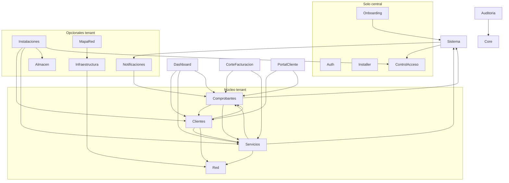

# Coherencia de módulos, dependencias y reducción de bases de datos

Documento de revisión: coherencia entre módulos, dependencias (central vs tenant) y opciones para reducir el uso de bases de datos sin perder modularidad.

**Índice de documentación:** Ver [docs/README.md](README.md) si existe; en su defecto, ver [MULTITENANCY.md](MULTITENANCY.md), [NOMENCLATURA_BD.md](NOMENCLATURA_BD.md), [PERMISOS_Y_ROLES.md](PERMISOS_Y_ROLES.md), [ESTANDAR_VISTAS.md](ESTANDAR_VISTAS.md), [PANEL_CENTRAL.md](PANEL_CENTRAL.md).

---

## 1. Resumen por ámbito de base de datos

| Ámbito | Conexión | Tablas | Módulos que las usan |
|--------|----------|--------|------------------------|
| **Central** | `mysql` | isps, users, roles, permissions, permission_role, plans, superadmin_audit_logs, tenant_requests, tenant_activation_tokens, platform_settings | Auth, ControlAcceso, Sistema, Installer, Onboarding, Auditoria (superadmin) |
| **Tenant** | dinámica `isp_{id}` | 50+ tablas (clientes, servicios, planes, recibos, comprobantes, etc.) | Clientes, Servicios, Comprobantes, Red, Sistema (avisos, medios_pago, onu_*), Notificaciones, Instalaciones, Infraestructura, Almacen, MapaRed, CorteFacturacion, PortalCliente, Auditoria (tenant) |

---

## 2. Mapa módulo → conexión y tablas

**Lista actual de módulos (referencia rápida):** Installer, Auth, Dashboard, ControlAcceso, Clientes, Servicios, Comprobantes, Red, Sistema, Notificaciones, Auditoria, Instalaciones, Infraestructura, Almacen, MapaRed, CorteFacturacion, Onboarding, Tenant, PortalCliente. Cada uno carga rutas vía `ModuleServiceProvider::loadRoutesFrom` salvo Installer y Auth (cargados con `require` en `routes/web.php` para conservar middleware `web`). Dónde vive cada dato: ver tablas siguientes.

### 2.1 Solo central (sin tablas tenant)

| Módulo | Tablas / modelos | Observación |
|--------|-------------------|-------------|
| **Auth** | users (login) | Usa ControlAcceso\User |
| **Installer** | users, roles (comprueba instalación) | No define modelos |
| **ControlAcceso** | users, roles, permissions, permission_role | `$connection = 'mysql'` en User, Role, Permission |
| **Sistema (parte)** | isps, plans | Isp, Plan (Sistema\Plan = planes SaaS límites) |
| **Onboarding** | tenant_requests, plans, tenant_activation_tokens | Usa Sistema\TenantRequest, Sistema\Plan |
| **Tenant (módulo)** | Ninguna | Solo vistas de estado (suspended, pending, cancelled) |

### 2.2 Solo tenant

| Módulo | Tablas tenant principales |
|--------|---------------------------|
| **Clientes** | clientes, ubicaciones, cliente_credenciales, tickets, ticket_mensajes |
| **Servicios** | servicios, planes (planes del ISP), plan_dhcp_config, onu_modelos, onus |
| **Comprobantes** | recibos, pagos, comprobantes, comprobante_items, promesas_pago, series_comprobantes, categoria_gastos, gastos |
| **Red** | nodos, routers, reglas |
| **Sistema (parte)** | medios_pago, onu_marcas, api_configs, avisos |
| **Notificaciones** | plantillas_whatsapp |
| **Instalaciones** | ordenes_instalacion, orden_instalacion_archivos, comisiones_vendedor |
| **Infraestructura** | postes, cajas_nap, hilos, mufas, cables, recorridos, recorrido_puntos, olts, olt_puertos_pon, odfs, odf_puertos, enlace_olt_odf, recorrido_hilo_origen, splitters, splitter_salidas |
| **Almacen** | almacenes, articulos, stock, movimientos_inventario, orden_instalacion_materiales |
| **MapaRed** | mapa_red_* (proyectos, versiones, capas, nodos, enlaces) |
| **Auditoria** | audit_logs (tenant) |
| **PortalCliente** | Usa clientes, cliente_credenciales, recibos, pagos, tickets (no define tablas) |
| **CorteFacturacion** | Usa recibos, servicios (no define tablas) |
| **Dashboard** | Usa Clientes, Servicios, Comprobantes (no define tablas) |

### 2.3 Cruce central–tenant

- **users** (central) referenciados desde tenant: `pagos.registrado_por`, `comprobantes.generado_por`, `audit_logs.user_id`, `tickets.asignado_a`, `gastos.registrado_por`. Sin FK; se usa `unsignedBigInteger` y relación en modelo si aplica.
- **isps** (central): cada fila tiene `database_name`; el tenant se resuelve por conexión `isp_{id}`.

---

## 3. Dependencias entre módulos (resumen)

- **Módulos sin dependencias de otros módulos (aparte de Core):** Auth, Installer, ControlAcceso, Red (solo Core), Auditoria.
- **Más acoplados:** Dashboard, Comprobantes, Clientes, Servicios (muchos dependen de ellos).

---

## 4. Incoherencias detectadas y correcciones

### 4.1 Modelo Isp sin plan_id ni plan()

- **Problema:** La migración `2026_02_16_000001_add_status_and_plan_to_isps_central.php` añade `status` y `plan_id` a `isps`, y `PlanLimitService` usa `$isp->plan`. El modelo `Isp` no tiene `plan_id` en `$fillable` ni relación `plan()`.
- **Corrección:** Añadir en `App\Modules\Sistema\Models\Isp`: `plan_id` y `status` en `$fillable`, relación `plan()` a `Sistema\Plan`, y cast de `status` si aplica.

### 4.2 Dos modelos “Plan” (evitar confusión)

- **Sistema\Plan** (central, tabla `plans`): planes SaaS (límites max_clientes, max_usuarios, precio). Relación con Isp.
- **Servicios\Plan** (tenant, tabla `planes`): planes de servicio del ISP (velocidad, precio_mensual, router_id, etc.).
- **Recomendación:** Mantener ambos; documentar en código con PHPDoc: “Plan SaaS (central)” vs “Plan de servicio (tenant)”. No unificar: ámbitos distintos.

### 4.3 Tablas central sin uso en código

- **platform_settings**, **tenant_activation_tokens:** Creadas en onboarding; sin referencias en `app/`. Dejar como reservadas o eliminar en una migración futura si se confirma que no se usarán.

### 4.4 Rutas de módulos

- **Installer:** Rutas cargadas por `require` en `routes/web.php` (no por ModuleServiceProvider). Coherente con el plan de modularización.
- **Auth:** Rutas por `require` en `routes/web.php`. Resto de módulos cargan rutas con `loadRoutesFrom` en su `ModuleServiceProvider`.

---

## 5. Opciones para reducir bases de datos (sin perder modularidad)

### 5.1 Mantener database-per-tenant (recomendado por aislamiento)

- No se reduce el número de BDs por tenant; se mantiene una BD física por ISP.
- **Reducción posible:** Menos tablas por tenant (ver 5.4 y 5.5).

### 5.2 Modo single-tenant (un solo ISP por despliegue)

- **Objetivo:** Un solo despliegue = una sola BD (central + tenant en la misma BD).
- **Cómo:** Variable de entorno `SINGLE_TENANT=true` y que `TenantConnectionService` use la conexión `mysql` como tenant cuando solo exista un ISP y se use esa opción. Las tablas “tenant” llevarían prefijo opcional (ej. `tenant_clientes`) o se mantienen sin prefijo en la misma BD que `users`/`isps`.
- **Ventaja:** Una sola BD que gestionar (backup, coste).
- **Inconveniente:** Migraciones y código deben contemplar que central y tenant comparten BD (evitar colisión de nombres y scopes por `isp_id`).
- **Modularidad:** Se mantiene; los módulos siguen usando los mismos modelos y la misma lógica; solo cambia la resolución de la conexión tenant.

### 5.3 Schema-per-tenant en el mismo servidor MySQL

- **Objetivo:** Mismo servidor MySQL, un schema (BD lógica) por tenant: `adminisp_isp_1`, `adminisp_isp_2`, etc.
- **Efecto:** No se reduce el número de BDs lógicas; se reduce el número de servidores (una sola instancia MySQL). Las conexiones Laravel siguen siendo una por tenant.
- **Modularidad:** Sin cambios; ya es el patrón actual (cada tenant = una “base de datos” en MySQL).

### 5.4 Reducir tablas tenant por módulo opcional (lazy migrations)

- **Objetivo:** No crear tablas de módulos que el ISP no use.
- **Cómo:** Migraciones tenant separadas por “feature” (infraestructura FTTH, almacén, mapa_red, instalaciones, etc.) y ejecutarlas solo cuando el ISP active ese módulo, o al primer acceso (como hace Instalaciones/Almacen con `asegurarTablaInstalaciones`).
- **Ventaja:** Menos tablas por tenant cuando un ISP no usa Infraestructura FTTH, Almacen, etc.
- **Modularidad:** Se mantiene; cada módulo sigue teniendo sus modelos y sus migraciones; solo se retrasa la creación de tablas.

### 5.5 Consolidar tablas central poco usadas

- **platform_settings:** Si no se usa, no crear la tabla (o eliminarla en migración) para reducir ruido en central.
- **tenant_activation_tokens / tenant_requests:** Si el onboarding se simplifica y solo se usa `tenant_requests`, valorar unificar en una sola tabla con estado “pendiente/activado” y token opcional, en lugar de dos tablas.
- **Modularidad:** Onboarding y Sistema siguen siendo módulos; solo se simplifica el esquema central.

### 5.6 Columna isp_id en tablas tenant

- En database-per-tenant, la conexión ya identifica el ISP; `isp_id` es redundante para el scope.
- **Recomendación actual:** Mantenerla (reportes, auditoría, posible migración a otro patrón). No eliminarla sin plan de migración y actualización de BelongsToIsp y consultas.

---

## 6. Resumen de acciones recomendadas

| Prioridad | Acción |
|-----------|--------|
| Alta | Corregir modelo **Isp**: añadir `plan_id`, `status` y relación `plan()` para coherencia con migración y PlanLimitService. |
| Media | Documentar en código la diferencia entre **Sistema\Plan** (SaaS) y **Servicios\Plan** (planes del ISP). |
| Media | Valorar **modo single-tenant** (una BD total) si el despliegue es siempre un solo ISP; implementar detrás de config/env. |
| Baja | Aplicar **lazy migrations** por módulo opcional (Infraestructura FTTH, Almacen, MapaRed) para reducir tablas en tenants que no los usan. |
| Baja | Revisar uso de **platform_settings** y **tenant_activation_tokens**; eliminar o consolidar si no hay uso previsto. |

---

## 7. Referencias

- [config/tenant.php](config/tenant.php) — Configuración multi-tenant.
- [docs/MULTITENANCY.md](MULTITENANCY.md) — Patrón database-per-tenant.
- [docs/ANALISIS_BD_COMPLETO.md](ANALISIS_BD_COMPLETO.md) — Tablas y modelos.
- [docs/ANALISIS_MODULOS_EXHAUSTIVO.md](ANALISIS_MODULOS_EXHAUSTIVO.md) — Detalle por módulo.
