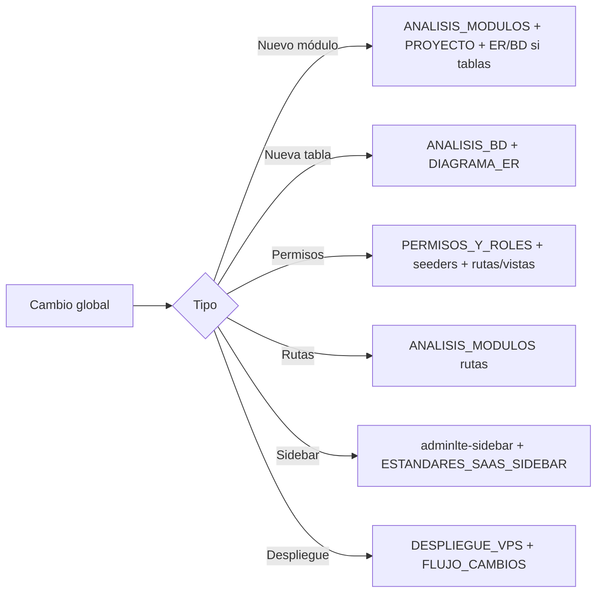

# Documentación completa — Admin ISP

Punto de entrada único a la documentación del proyecto: índice de todos los documentos, convenciones de actualización y guía para **modificaciones globales** (qué documentos y qué código tocar por tipo de cambio).

**Uso:** Para consultar "dónde se documenta X" → ver [sección 2 (Índice maestro)](#2-índice-maestro-de-documentación). Para planificar un cambio que afecte varios módulos, BD, permisos o despliegue → ver [sección 4 (Guía de modificaciones globales)](#4-guía-de-modificaciones-globales). Ver también [.cursorrules](../.cursorrules) para reglas de despliegue en VPS.

---

## 1. Introducción

Este documento reúne:

- **Índice maestro:** clasificación de todos los documentos en `docs/` por categoría, con enlace y descripción breve, y tabla de documentos canónicos por tema.
- **Convenciones:** cómo nombrar nuevos documentos, dónde registrar cambios (módulo, tabla, permiso) y cuándo actualizar los documentos pilar (ANALISIS_BD, ANALISIS_PROYECTO, ANALISIS_MODULOS, DIAGRAMA_ER).
- **Guía de modificaciones globales:** por cada tipo de cambio (nuevo módulo, nueva tabla, migración, permisos, rutas, sidebar, auth/tenant, despliegue), lista de documentos a actualizar y archivos de código a tocar, con orden recomendado.

Los documentos pilar ([ANALISIS_BD_COMPLETO.md](ANALISIS_BD_COMPLETO.md), [ANALISIS_PROYECTO_COMPLETO.md](ANALISIS_PROYECTO_COMPLETO.md), [ANALISIS_MODULOS_EXHAUSTIVO.md](ANALISIS_MODULOS_EXHAUSTIVO.md), [DIAGRAMA_ENTIDAD_RELACION.md](DIAGRAMA_ENTIDAD_RELACION.md)) contienen el detalle; este doc no lo duplica y hace referencia a ellos cuando aplica.

---

## 2. Índice maestro de documentación

### 2.1 Arquitectura y análisis

| Documento | Descripción |
|-----------|-------------|
| [DOCUMENTACION_COMPLETA.md](DOCUMENTACION_COMPLETA.md) | Este documento: índice maestro, convenciones y guía de modificaciones globales (punto de entrada único). |
| [ANALISIS_PROYECTO_COMPLETO.md](ANALISIS_PROYECTO_COMPLETO.md) | Visión global: estructura, stack, módulos, rutas, auth, frontend, config, seguridad, despliegue. |
| [ANALISIS_BD_COMPLETO.md](ANALISIS_BD_COMPLETO.md) | Esquema BD central y tenant, tablas, modelos, migraciones, coherencia modelo-BD. |
| [ANALISIS_MODULOS_EXHAUSTIVO.md](ANALISIS_MODULOS_EXHAUSTIVO.md) | Análisis módulo por módulo: rutas, controladores, modelos, servicios, políticas, vistas, permisos, "para modificaciones posteriores". |
| [DIAGRAMA_ENTIDAD_RELACION.md](DIAGRAMA_ENTIDAD_RELACION.md) | Diagramas ER (Mermaid): BD central, tenant núcleo comercial, infraestructura, almacén, mapa de red. |
| [MULTITENANCY.md](MULTITENANCY.md) | Patrón multi-tenant (database-per-tenant) y uso. |
| [PANEL_CENTRAL.md](PANEL_CENTRAL.md) | Panel central y relación con tenants. |

### 2.2 Base de datos y migraciones

| Documento | Descripción |
|-----------|-------------|
| [ANALISIS_BD_COMPLETO.md](ANALISIS_BD_COMPLETO.md) | Documento canónico para esquema y migraciones. |
| [DIAGRAMA_ENTIDAD_RELACION.md](DIAGRAMA_ENTIDAD_RELACION.md) | Diagramas ER; actualizar al añadir/quitar tablas o relaciones. |
| [MIGRACION_MULTITENANT.md](MIGRACION_MULTITENANT.md) | Migración al modelo multi-tenant. |
| [CAMBIO_BD_ISP.md](CAMBIO_BD_ISP.md) | Cambios de BD por ISP. |
| [REVISION_BD_Y_PROYECTO.md](REVISION_BD_Y_PROYECTO.md) | Revisión histórica BD y proyecto. |

### 2.3 Módulos y funcionalidad

| Documento | Descripción |
|-----------|-------------|
| [ANALISIS_MODULOS_EXHAUSTIVO.md](ANALISIS_MODULOS_EXHAUSTIVO.md) | Documento canónico por módulo; actualizar al añadir/cambiar módulos. |
| [ANALISIS_MAPA_INFRAESTRUCTURA.md](ANALISIS_MAPA_INFRAESTRUCTURA.md) | Análisis del mapa de infraestructura. |
| [MEJORAS_MODULO_INFRAESTRUCTURA_DETALLE_PON.md](MEJORAS_MODULO_INFRAESTRUCTURA_DETALLE_PON.md) | Mejoras del módulo Infraestructura / Detalle PON. |
| [MAPA_UBICACION.md](MAPA_UBICACION.md) | Mapa de ubicaciones. |

### 2.4 Estándares

| Documento | Descripción |
|-----------|-------------|
| [ESTANDAR_VISTAS.md](ESTANDAR_VISTAS.md) | Estándares de vistas Blade. |
| [ESTANDAR_MOBILE_FIRST.md](ESTANDAR_MOBILE_FIRST.md) | Diseño mobile-first. |
| [ESTANDARES_COMPROBANTES.md](ESTANDARES_COMPROBANTES.md) | Estándares de comprobantes fiscales. |
| [ESTANDARES_SAAS_SIDEBAR.md](ESTANDARES_SAAS_SIDEBAR.md) | Estándares del sidebar SaaS. |
| [DESIGN_TOKENS.md](DESIGN_TOKENS.md) | Tokens de diseño. |
| [PALETA_CORPORATIVA.md](PALETA_CORPORATIVA.md) | Paleta de colores. |
| [PREVENCION_ERRORES.md](PREVENCION_ERRORES.md) | Prevención de errores recurrentes (419, 403, etc.). |

### 2.5 Despliegue y operaciones

| Documento | Descripción |
|-----------|-------------|
| [DESPLIEGUE_VPS.md](DESPLIEGUE_VPS.md) | Documento canónico para despliegue en VPS. |
| [DEPLOY_DOCKER.md](DEPLOY_DOCKER.md) | Despliegue con Docker. |
| [DEPLOY_CPANEL.md](DEPLOY_CPANEL.md) | Despliegue en cPanel. |
| [FLUJO_CAMBIOS.md](FLUJO_CAMBIOS.md) | Flujo Git + VPS (guardar cambios y subir a panel.wan.pe). |
| [SSH_AGENTE_A_VPS.md](SSH_AGENTE_A_VPS.md) | Uso de SSH/agente para conexión a VPS. |

### 2.6 Permisos y roles

| Documento | Descripción |
|-----------|-------------|
| [PERMISOS_Y_ROLES.md](PERMISOS_Y_ROLES.md) | **Documento de referencia** para cambios en permisos y roles. |
| [PERMISOS_Y_ROLES_SAAS_GRAN_MAGNITUD.md](PERMISOS_Y_ROLES_SAAS_GRAN_MAGNITUD.md) | Permisos y roles a escala SaaS. |
| [PERMISOS_COMPROBANTES.md](PERMISOS_COMPROBANTES.md) | Permisos del módulo Comprobantes. |
| [REVISION_PERMISOS_EXISTENTES.md](REVISION_PERMISOS_EXISTENTES.md) | Revisión de permisos existentes. |
| [PROPUESTA_PERMISOS_Y_ACCIONES.md](PROPUESTA_PERMISOS_Y_ACCIONES.md) | Propuesta de permisos y acciones. |
| [VERIFICACION_PERMISOS_CRM.md](VERIFICACION_PERMISOS_CRM.md) | Verificación de permisos en el CRM. |

### 2.7 Planes, procedimientos y referencia

| Documento | Descripción |
|-----------|-------------|
| [PLAN_SAAS_100.md](PLAN_SAAS_100.md) | Plan SaaS al 100%. |
| [PLAN_SAAS_MODULOS_SUPERDETALLADO.md](PLAN_SAAS_MODULOS_SUPERDETALLADO.md) | Plan de módulos SaaS detallado. |
| [CHECKLIST-PROYECTO-100-COMPLETO.md](CHECKLIST-PROYECTO-100-COMPLETO.md) | Checklist de proyecto completo. |
| [MANUAL-PROCEDIMIENTOS-registro-cliente-facturacion.md](MANUAL-PROCEDIMIENTOS-registro-cliente-facturacion.md) | Manual: registro cliente y facturación. |
| [PLAN-COMPROBACION-FUNCIONAMIENTO.md](PLAN-COMPROBACION-FUNCIONAMIENTO.md) | Plan de comprobación de funcionamiento. |
| [ANALISIS-BRECHAS-WispHub-vs-AdminISP.md](ANALISIS-BRECHAS-WispHub-vs-AdminISP.md) | Brechas WispHub vs AdminISP. |
| [MikroTik-WISP-investigacion.md](MikroTik-WISP-investigacion.md) | Investigación MikroTik WISP. |
| [Mikrowisp-funcionalidades-referencia.md](Mikrowisp-funcionalidades-referencia.md) | Funcionalidades de referencia Mikrowisp. |
| [CURSOR_SKILLS.md](CURSOR_SKILLS.md) | Skills de Cursor. |
| [TEMAS.md](TEMAS.md) | Temas (UI). |

### 2.8 Documentos canónicos por tema

| Tema | Documento principal a actualizar |
|------|----------------------------------|
| Arquitectura / visión global | [ANALISIS_PROYECTO_COMPLETO.md](ANALISIS_PROYECTO_COMPLETO.md) |
| Base de datos / migraciones | [ANALISIS_BD_COMPLETO.md](ANALISIS_BD_COMPLETO.md), [DIAGRAMA_ENTIDAD_RELACION.md](DIAGRAMA_ENTIDAD_RELACION.md) |
| Módulos (rutas, controladores, modelos) | [ANALISIS_MODULOS_EXHAUSTIVO.md](ANALISIS_MODULOS_EXHAUSTIVO.md) |
| Permisos y roles | [PERMISOS_Y_ROLES.md](PERMISOS_Y_ROLES.md) (y seeders en código) |
| Despliegue | [DESPLIEGUE_VPS.md](DESPLIEGUE_VPS.md), [FLUJO_CAMBIOS.md](FLUJO_CAMBIOS.md) |
| Estándares (vistas, UI, comprobantes) | [ESTANDAR_VISTAS.md](ESTANDAR_VISTAS.md), [ESTANDARES_COMPROBANTES.md](ESTANDARES_COMPROBANTES.md) según corresponda |

---

## 3. Convenciones de documentación

- **Naming:** Usar MAYÚSCULAS_Y_GUIONES para nombres de archivos en `docs/` (consistente con la mayoría actual: ANALISIS_BD_COMPLETO, ESTANDAR_VISTAS, etc.).
- **Dónde registrar qué:**
  - Al **añadir un módulo:** actualizar [ANALISIS_MODULOS_EXHAUSTIVO.md](ANALISIS_MODULOS_EXHAUSTIVO.md) (nueva sección con la plantilla del doc); si el módulo introduce tablas, actualizar [DIAGRAMA_ENTIDAD_RELACION.md](DIAGRAMA_ENTIDAD_RELACION.md) y [ANALISIS_BD_COMPLETO.md](ANALISIS_BD_COMPLETO.md); actualizar sección módulos en [ANALISIS_PROYECTO_COMPLETO.md](ANALISIS_PROYECTO_COMPLETO.md).
  - Al **añadir tabla o relación (central o tenant):** nueva migración en `database/migrations/` o `database/migrations/tenant/`; actualizar [DIAGRAMA_ENTIDAD_RELACION.md](DIAGRAMA_ENTIDAD_RELACION.md) y [ANALISIS_BD_COMPLETO.md](ANALISIS_BD_COMPLETO.md) (listado de tablas / modelo).
  - Al **añadir o cambiar permisos:** actualizar documento de referencia [PERMISOS_Y_ROLES.md](PERMISOS_Y_ROLES.md) (o el canónico que se use); actualizar seeders (ej. `RolePermissionSeeder`, `CreatePermissionsCommand`) y rutas que usen `permission:`.
- **Cuándo actualizar el diagrama ER:** Siempre que se añadan o eliminen tablas o relaciones relevantes en BD central o tenant.
- **Cuándo actualizar el análisis de módulos:** Siempre que se añada o retire un módulo, o se cambien rutas/controladores/modelos de forma estructural (nuevo controlador, nuevo resource, cambio de prefijo).
- **Referencias cruzadas:** Los documentos pilar (ANALISIS_BD, ANALISIS_PROYECTO, ANALISIS_MODULOS, DIAGRAMA_ER) deben enlazarse entre sí donde sea relevante. Al crear un doc nuevo que dependa de ellos, enlazar al pilar correspondiente.

---

## 4. Guía de modificaciones globales

Para cada tipo de cambio se indican: documentos a actualizar, archivos/áreas de código a tocar y orden recomendado. El detalle por módulo está en [ANALISIS_MODULOS_EXHAUSTIVO.md](ANALISIS_MODULOS_EXHAUSTIVO.md) en la subsección "Para modificaciones posteriores" de cada módulo.

### 4.1 Añadir un nuevo módulo

- **Documentos a actualizar:** [ANALISIS_MODULOS_EXHAUSTIVO.md](ANALISIS_MODULOS_EXHAUSTIVO.md) (nueva sección con plantilla), [ANALISIS_PROYECTO_COMPLETO.md](ANALISIS_PROYECTO_COMPLETO.md) (tabla de módulos y registro de rutas). Si hay tablas nuevas: [DIAGRAMA_ENTIDAD_RELACION.md](DIAGRAMA_ENTIDAD_RELACION.md), [ANALISIS_BD_COMPLETO.md](ANALISIS_BD_COMPLETO.md). Si el módulo tiene permisos: [PERMISOS_Y_ROLES.md](PERMISOS_Y_ROLES.md) y este doc (índice) si se añade un nuevo .md en docs/.
- **Código a tocar:** `app/Modules/NombreModulo/` (ModuleServiceProvider, Routes/web.php, Controllers, Models, Policies, Requests, etc.); `bootstrap/app.php` (registrar `\App\Modules\NombreModulo\ModuleServiceProvider::class`); `routes/web.php` o `routes/api.php` si las rutas se cargan por require o API; `resources/views/nombre-modulo/`; `resources/views/layouts/partials/adminlte-sidebar.blade.php` si el módulo tiene entrada en menú; seeders de permisos (ej. `database/seeders/RolePermissionSeeder.php` o comando CreatePermissions) si usa permisos.
- **Orden recomendado:** Crear carpeta del módulo y ModuleServiceProvider → migraciones si aplica → modelos → controladores y rutas → políticas y requests → vistas → registrar provider en bootstrap/app.php → añadir entrada en sidebar si aplica → seeders permisos → actualizar docs.

### 4.2 Añadir nueva entidad/tabla (tenant o central) y modelo

- **Documentos a actualizar:** [ANALISIS_BD_COMPLETO.md](ANALISIS_BD_COMPLETO.md) (tabla y modelo en listado), [DIAGRAMA_ENTIDAD_RELACION.md](DIAGRAMA_ENTIDAD_RELACION.md) (entidad y relaciones en el diagrama correspondiente). Si la tabla pertenece a un módulo ya documentado: [ANALISIS_MODULOS_EXHAUSTIVO.md](ANALISIS_MODULOS_EXHAUSTIVO.md) sección de ese módulo (modelos).
- **Código a tocar:** `database/migrations/` o `database/migrations/tenant/` (nueva migración); `app/Modules/Módulo/Models/NombreModelo.php`; relaciones en modelos existentes; si hay CRUD: controlador, rutas, políticas, Form Requests, vistas.
- **Orden recomendado:** Migración → modelo (y relaciones) → actualizar docs BD y ER; luego CRUD si aplica.

### 4.3 Modificar esquema de una tabla existente (migración)

- **Documentos a actualizar:** [ANALISIS_BD_COMPLETO.md](ANALISIS_BD_COMPLETO.md) (descripción de la tabla y listado de migraciones); [DIAGRAMA_ENTIDAD_RELACION.md](DIAGRAMA_ENTIDAD_RELACION.md) si cambian atributos o relaciones relevantes.
- **Código a tocar:** `database/migrations/` o `database/migrations/tenant/` (nueva migración); modelo Eloquent (`$fillable`, `$casts`, relaciones); Form Requests y controladores que usen los campos; vistas que muestren/editen esos campos.
- **Orden recomendado:** Migración → modelo → código que usa los campos → docs.

### 4.4 Añadir o cambiar permisos / roles

- **Documentos a actualizar:** [PERMISOS_Y_ROLES.md](PERMISOS_Y_ROLES.md) (o documento canónico de permisos); [ANALISIS_MODULOS_EXHAUSTIVO.md](ANALISIS_MODULOS_EXHAUSTIVO.md) en los módulos afectados (subsección Permisos). Si cambia el sidebar: [ESTANDARES_SAAS_SIDEBAR.md](ESTANDARES_SAAS_SIDEBAR.md) si aplica.
- **Código a tocar:** Seeders (ej. `RolePermissionSeeder`, `CreatePermissionsCommand`); rutas que usen `middleware('permission:...')`; vistas que usen `@hasPermission`, `@canField`; `app/Modules/ControlAcceso/` (Permission, Role, PermissionService); `resources/views/layouts/partials/adminlte-sidebar.blade.php` (condiciones por permiso).
- **Orden recomendado:** Definir nombre del permiso y asignación a roles en seeders/comando → añadir middleware y directivas Blade donde corresponda → actualizar doc de permisos.

### 4.5 Añadir o cambiar rutas (web o API)

- **Documentos a actualizar:** [ANALISIS_MODULOS_EXHAUSTIVO.md](ANALISIS_MODULOS_EXHAUSTIVO.md) (sección Rutas del módulo afectado); [ANALISIS_PROYECTO_COMPLETO.md](ANALISIS_PROYECTO_COMPLETO.md) (resumen de rutas si es un cambio estructural).
- **Código a tocar:** `app/Modules/Módulo/Routes/web.php` o `routes/web.php` (require) o `routes/api.php`; controlador y método; `bootstrap/app.php` solo si se añade un provider que carga rutas.
- **Orden recomendado:** Controlador (método) → ruta → vista si aplica → actualizar ANALISIS_MODULOS (rutas).

### 4.6 Cambiar entrada en menú / sidebar

- **Documentos a actualizar:** [ESTANDARES_SAAS_SIDEBAR.md](ESTANDARES_SAAS_SIDEBAR.md) si se cambia la estructura estándar del menú; [ANALISIS_MODULOS_EXHAUSTIVO.md](ANALISIS_MODULOS_EXHAUSTIVO.md) (Vistas / Permisos del módulo) si se añade o quita ítem.
- **Código a tocar:** `resources/views/layouts/partials/adminlte-sidebar.blade.php`; `adminlte-sidebar-superadmin.blade.php` si aplica. Permisos usados en `@hasPermission` o lógica de visibilidad.
- **Orden recomendado:** Decidir ruta y permiso → modificar sidebar → actualizar estándar si procede.

### 4.7 Cambiar flujo de autenticación o resolución de tenant

- **Documentos a actualizar:** [ANALISIS_PROYECTO_COMPLETO.md](ANALISIS_PROYECTO_COMPLETO.md) (sección Autenticación y autorización / Tenant); [MULTITENANCY.md](MULTITENANCY.md) si cambia resolución de tenant; [ANALISIS_MODULOS_EXHAUSTIVO.md](ANALISIS_MODULOS_EXHAUSTIVO.md) módulo Auth.
- **Código a tocar:** Auth: `app/Modules/Auth/`, `app/Http/Middleware/` (RedirectIfNotInstalled, EnsurePortalCliente, etc.); tenant: `app/Core/Middleware/SetIspContext.php`, `app/Core/Services/TenantConnectionService.php`, `config/tenant.php`; `bootstrap/app.php` (middleware).
- **Orden recomendado:** Cambio en middleware/servicio → config si aplica → actualizar docs.

### 4.8 Cambiar proceso de despliegue (VPS / Docker)

- **Documentos a actualizar:** [DESPLIEGUE_VPS.md](DESPLIEGUE_VPS.md), [DEPLOY_DOCKER.md](DEPLOY_DOCKER.md), [FLUJO_CAMBIOS.md](FLUJO_CAMBIOS.md); [.cursorrules](../.cursorrules) si cambian las reglas de "siempre subir a VPS".
- **Código a tocar:** Scripts en `scripts/`, configuración en `config/`, `docker/`; no suele haber código de aplicación, salvo que el despliegue afecte a rutas o env.
- **Orden recomendado:** Cambiar proceso (scripts/config) → actualizar los tres docs y .cursorrules.

### 4.9 Unificar o deprecar documentos

- **Documentos a actualizar:** Este documento (DOCUMENTACION_COMPLETA.md): índice y tabla canónica (quitar o marcar como deprecado el doc fusionado); cualquier otro .md que enlace al doc eliminado.
- **Código a tocar:** Ninguno (solo docs).
- **Consideraciones:** Comprobar enlaces desde otros .md y desde .cursorrules; si un doc se marca deprecado, añadir una línea al inicio indicando "Reemplazado por X" y enlazar al canónico.

### 4.10 Diagrama de flujo (resumen)

---

## 5. Clasificación de documentos existentes

En el [Índice maestro (§2)](#2-índice-maestro-de-documentación) cada uno de los 37 documentos está asignado a una categoría. Resumen:

- **Arquitectura y análisis:** 6 docs. Canónicos: ANALISIS_PROYECTO_COMPLETO, ANALISIS_BD_COMPLETO, ANALISIS_MODULOS_EXHAUSTIVO, DIAGRAMA_ENTIDAD_RELACION.
- **BD y migraciones:** 5 docs (ANALISIS_BD y DIAGRAMA_ER son canónicos).
- **Módulos y funcionalidad:** 4 docs (ANALISIS_MODULOS_EXHAUSTIVO canónico).
- **Estándares:** 7 docs.
- **Despliegue y operaciones:** 5 docs (DESPLIEGUE_VPS y FLUJO_CAMBIOS de referencia).
- **Permisos y roles:** 6 docs; **documento de referencia para "cambios en permisos":** [PERMISOS_Y_ROLES.md](PERMISOS_Y_ROLES.md). Los demás son complemento o referencia histórica (PERMISOS_Y_ROLES_SAAS_GRAN_MAGNITUD, PERMISOS_COMPROBANTES, etc.).
- **Planes, procedimientos y referencia:** 10 docs.

No se han eliminado ni fusionado documentos; solo se han clasificado y enlazado. Una fase posterior puede proponer fusiones concretas (por ejemplo, unificar varios de permisos en uno solo).

---

*Documento generado según el plan de documentación completa. Actualizar este doc (sección 2 Índice) cuando se añada un nuevo archivo en `docs/`.*
